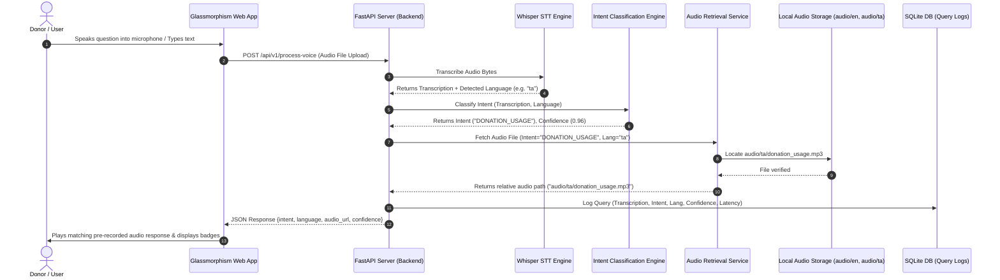
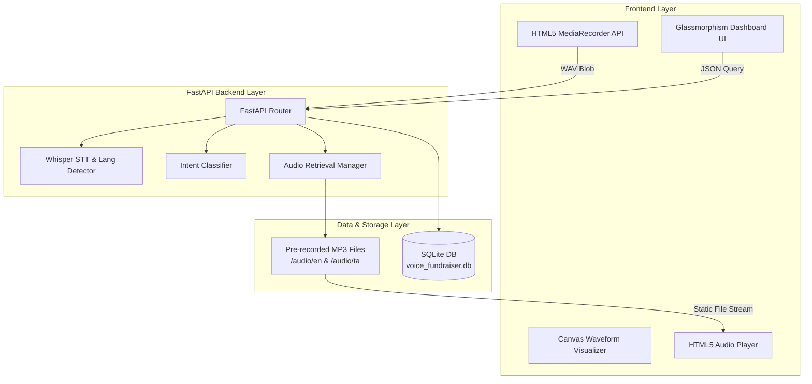

# AI-Powered Voice Response Retrieval for Fundraising (PoC)

An enterprise-grade Proof of Concept (PoC) for an AI-powered voice assistant designed for non-profit fundraising organizations. 

Rather than generating speech on-the-fly using synthetic Text-to-Speech (TTS)—which can introduce latency, robotic tone artifacting, and compliance concerns—this solution:
1. Accepts spoken questions from donors in **Tamil** or **English**.
2. Transcribes speech to text using **Whisper STT**.
3. Detects language (`ta` or `en`) automatically.
4. Classifies the query into one of **12 predefined intents**.
5. Instantly retrieves and plays the corresponding **human pre-recorded audio response**.

---

## 🏛️ 1. Overall System Architecture

### Mermaid Sequence Diagram



### Component Architecture Diagram



---

## 🔌 2. API Design Specification

### Main Endpoints

#### 1. Process Voice Upload
- **Endpoint**: `POST /api/v1/process-voice`
- **Content-Type**: `multipart/form-data`
- **Body**: `file` (Audio file `.wav`, `.webm`, or `.mp3`)
- **Sample Response**:
```json
{
  "transcription": "நன்கொடை பணம் எவ்வாறு பயன்படுத்தப்படுகிறது?",
  "language": "ta",
  "language_name": "Tamil",
  "intent": "DONATION_USAGE",
  "intent_name": "Donation Utilization",
  "confidence": 0.96,
  "audio": "audio/ta/donation_usage.mp3",
  "audio_url": "/audio/ta/donation_usage.mp3",
  "processing_time_ms": 142.5
}
```

#### 2. Process Text Query (Testing Console)
- **Endpoint**: `POST /api/v1/process-text`
- **Content-Type**: `application/json`
- **Body**:
```json
{
  "text": "Do I get an 80G tax exemption certificate for my contribution?",
  "force_language": null
}
```
- **Sample Response**:
```json
{
  "transcription": "Do I get an 80G tax exemption certificate for my contribution?",
  "language": "en",
  "language_name": "English",
  "intent": "TAX_BENEFITS",
  "intent_name": "80G Tax Benefits",
  "confidence": 0.95,
  "audio": "audio/en/tax_benefits.mp3",
  "audio_url": "/audio/en/tax_benefits.mp3",
  "processing_time_ms": 48.2
}
```

#### 3. List Predefined Intents
- **Endpoint**: `GET /api/v1/intents`
- **Response**: Array of all 12 registered intents with English/Tamil descriptions and direct audio playback URLs.

#### 4. Analytics & Query Logs
- **Endpoint**: `GET /api/v1/analytics`
- **Response**: SQLite interaction history logs.

---

## 🗄️ 3. Database Schema (SQLite)

### Entity Relationship & Tables

#### `query_logs` Table
| Column Name | Data Type | Constraints | Description |
| :--- | :--- | :--- | :--- |
| `id` | INTEGER | PRIMARY KEY, AUTOINCREMENT | Unique log ID |
| `timestamp` | DATETIME | DEFAULT CURRENT_TIMESTAMP | UTC timestamp |
| `source_type` | VARCHAR(20) | NOT NULL | 'voice' or 'text' |
| `transcription` | TEXT | NOT NULL | Speech-to-text transcript |
| `detected_language` | VARCHAR(10) | NOT NULL | ISO language code (`en`, `ta`) |
| `classified_intent` | VARCHAR(50) | NOT NULL | Intent code (e.g. `DONATION_USAGE`) |
| `confidence_score` | FLOAT | NOT NULL | Confidence score (0.00 to 1.00) |
| `audio_relative_path` | VARCHAR(255) | NOT NULL | Retreived audio path |
| `processing_time_ms` | FLOAT | NOT NULL | Total API response latency |

#### `intents` Table
| Column Name | Data Type | Constraints | Description |
| :--- | :--- | :--- | :--- |
| `id` | INTEGER | PRIMARY KEY | Unique intent ID |
| `intent_code` | VARCHAR(50) | UNIQUE, NOT NULL | Intent slug identifier |
| `name` | VARCHAR(100) | NOT NULL | Human readable title |
| `description_en` | TEXT | NOT NULL | English summary |
| `description_ta` | TEXT | NOT NULL | Tamil summary |
| `file_name` | VARCHAR(100) | NOT NULL | Associated `.mp3` filename |

---

## 📂 4. Project Folder Structure

```
voice_fundraiser_poc/
├── audio/                      # Local Audio Repository
│   ├── en/                     # 12 English pre-recorded .mp3 files
│   │   ├── greeting.mp3
│   │   ├── about_home.mp3
│   │   ├── donation_usage.mp3
│   │   ├── tax_benefits.mp3
│   │   ├── payment_methods.mp3
│   │   ├── sponsor_child.mp3
│   │   ├── volunteer.mp3
│   │   ├── visiting_hours.mp3
│   │   ├── annual_report.mp3
│   │   ├── receipt_request.mp3
│   │   ├── contact_us.mp3
│   │   └── fallback.mp3
│   └── ta/                     # 12 Tamil pre-recorded .mp3 files
│       ├── greeting.mp3
│       └── ... (12 files)
│
├── app/                        # FastAPI Core Application
│   ├── __init__.py
│   ├── main.py                 # Application router & static file serving
│   ├── config.py               # Predefined Intent registry & paths
│   ├── database.py             # SQLite SQLAlchemy engine setup
│   ├── models.py               # SQLAlchemy ORM models
│   ├── schemas.py              # Pydantic validation schemas
│   └── services/
│       ├── __init__.py
│       ├── stt.py              # Whisper STT & Language detector
│       ├── intent.py           # Intent Classification engine & prompts
│       └── audio_retrieval.py  # Pre-recorded audio retrieval logic
│
├── frontend/                   # Interactive Glassmorphism Web App
│   ├── index.html              # Mic recorder, visualizer, audio player
│   ├── style.css               # Glassmorphism dark mode theme & animations
│   └── app.js                  # MediaRecorder API & backend integration
│
├── scripts/
│   ├── generate_audio.py       # Auto-populates 24 local pre-recorded mp3 files
│   └── init_db.py              # Database seeder
│
├── test_poc.py                 # Automated PoC test suite
├── requirements.txt            # Python dependencies
└── README.md                   # Complete Architecture Documentation
```

---

## 🤖 5. Intent Classification Prompt & Logic

### LLM System Prompt (For GPT-4 / Claude / Llama)
```text
You are an expert Intent Classification AI for a non-profit fundraising organization.
Given a user query transcript, identify the single best matching intent from the predefined list below.

Predefined Intents:
1. GREETING: Hello, hi, welcome greetings.
2. ABOUT_HOME: Information about the children's home, shelter, history, and mission.
3. DONATION_USAGE: How donated money/funds/resources are used and spent.
4. TAX_BENEFITS: 80G tax exemption, tax deduction details.
5. PAYMENT_METHODS: Bank details, UPI, QR code, GPAY, PhonePe, payment options.
6. SPONSOR_CHILD: Sponsoring a child's education, food, monthly support.
7. VOLUNTEER: Joining as a volunteer, teaching, contributing time.
8. VISITING_HOURS: Visiting schedule, timings, address, location details.
9. ANNUAL_REPORT: Audited financial statements, annual report, transparency.
10. RECEIPT_REQUEST: Claiming or receiving an official donation tax receipt.
11. CONTACT_US: Phone number, email address, contact details.
12. FALLBACK_UNKNOWN: Out of scope, ambiguous, or irrelevant questions.

Return JSON in this format:
{
  "intent": "<INTENT_CODE>",
  "language": "<ta | en>",
  "confidence": <0.0 to 1.0>,
  "reasoning": "<brief explanation>"
}
```

---

## 🔊 6. Pre-Recorded Audio Retrieval Logic

```python
def get_audio_path(intent_code: str, language: str = "en") -> Tuple[str, str]:
    lang_code = language if language in ["en", "ta"] else "en"
    intent_info = INTENTS_REGISTRY.get(intent_code, INTENTS_REGISTRY["FALLBACK_UNKNOWN"])
    file_name = intent_info["file_name"]

    relative_path = f"audio/{lang_code}/{file_name}"
    abs_path = AUDIO_DIR / lang_code / file_name

    # Fallback to default if file doesn't exist
    if not abs_path.exists():
        relative_path = f"audio/{lang_code}/fallback.mp3"

    return relative_path, str(abs_path)
```

---

## 🚀 7. Running the Demo

1. **Install Dependencies**:
```bash
pip install -r requirements.txt
```

2. **Generate Audio Files & Initialize DB**:
```bash
python scripts/generate_audio.py
python scripts/init_db.py
```

3. **Run Automated Test Suite**:
```bash
python test_poc.py
```

4. **Start the FastAPI Server**:
```bash
uvicorn app.main:app --reload --port 8000
```
Open **`http://localhost:8000`** in your browser to interact with the live glassmorphism UI!

---

## 🔮 8. Production Architecture Roadmap

Moving from PoC to a high-scale Production System:

```mermaid
graph TD
    IVR[Telephony IVR / Twilio / Asterisk] --> CloudGateway[API Gateway / NGINX]
    WebClient[Web & Mobile Apps] --> CloudGateway
    
    CloudGateway --> LoadBalancer[Load Balancer]
    
    subgraph Compute Cluster (Kubernetes)
        LoadBalancer --> WhisperCluster[GPU Whisper STT Workers]
        WhisperCluster --> VectorSearch[Fast Embeddings / Vector Intent Classifier]
    end

    subgraph Content Delivery Network (CDN)
        Cloudfront[CloudFront / Cloudflare Edge CDN] --> EdgeAudio[Pre-recorded Audio Files]
    end

    subgraph Persistence Layer
        VectorSearch --> MultiRegionDB[(PostgreSQL + Redis Cache)]
    end

    EdgeAudio -->|Low Latency Streaming| IVR
    EdgeAudio -->|Low Latency Streaming| WebClient
```

### Key Production Enhancements:
1. **Telephony Integration (IVR)**: Connect Asterisk / Twilio / Exotel so donors can call a toll-free number, ask questions verbally, and hear pre-recorded responses.
2. **Edge CDN Audio Delivery**: Host pre-recorded studio `.mp3` files on AWS CloudFront / Cloudflare R2 for sub-20ms global audio playback.
3. **Vector Database Classification**: Use Qdrant or Pinecone for ultra-fast (sub-10ms) vector similarity intent classification.
4. **Professional Studio Voice Recording**: Replace synthetic voice files with professional native Tamil and English voiceover artists.
